# WGCNA 分析  

## WGCNA基本概念  

加权基因共表达网络分析 (WGCNA, Weighted correlation network analysis)是用来描述不同样品之间基因关联模式的系统生物学方法，可以用来鉴定高度**协同变化**的基因集。并根据基因集的内连性和基因集与表型之间的关联鉴定候补生物标记基因或治疗靶点。  

相比于只关注差异表达的基因，WGCNA利用数千或近万个变化最大的基因或全部基因的信息识别感兴趣的基因集，并与表型进行显著性关联分析。一是充分利用了信息，二是把数千个基因与表型的关联转换为数个基因集与表型的关联，免去了多重假设检验校正的问题。  

## WGCNA常见术语  

+ 共表达网络（Co-expression network）：定义为加权基因网络。点代表基因，边代表基因表达相关性。加权是指对**相关性值进行冥次运算**。 (冥次的值也就是**软阈值** (`power`, `pickSoftThreshold`这个函数所做的就是确定合适的`power`))。无向网络的边属性计算方式为 `abs(cor(genex, geney)) ^ power`；有向网络的边属性计算方式为`(1+cor(genex, geney)/2) ^ power`; `sign hybrid`的边属性计算方式为`cor(genex, geney)^power if cor>0 else 0`。这种处理方式强化了强相关，弱化了弱相关或负相关，使得相关性数值更符合`无标度网络`特征，更具有生物意义。如果没有合适的**power**，一般是由于部分样品与其它样品因为某种原因差别太大导致的，可根据具体问题移除部分样品或查看后面的`经验值`。  
+ 模块（Module）：高度內连的基因集。在无向网络中，模块内是高度**相关**的基因。在有向网络中，模块内是高度**正相关**的基因。把基因聚类成模块后，可以对每个模块进行三个层次的分析：
  1. 功能富集分析查看其功能特征是否与研究目的相符；
  2. 模块与性状进行关联分析，找出与关注性状相关度最高的模块；
  3. 模块与样本进行关联分析，找到样品特异高表达的模块。
+ 连接度（Connectivity）：类似于网络中 "度"(degree)的概念。每个基因的连接度是与其他网络基因的连接度。 在共表达网络中，连接度衡量的是一个基因与其他的网络基因有多相关。 
+ 模块内连接度（Intramodular connectivity）: 模块内连接度衡量的是给定基因相对于特定模块的基因是如何连接或共同表达的。模内连接性可以解释为模块成员关系的度量。  
+ Module eigengene E: 给定模型的第一主成分，代表**整个模型的基因表达谱**。  
+ Module membership: 给定基因表达谱与给定模型的eigengene的相关性。  
+ Hub gene: 关键基因 (连接度最多或连接多个模块的基因)。  
+ Adjacency matrix ：基因和基因之间的加权相关性值构成的矩阵。  
+ TOM (Topological overlap matrix)：把邻接矩阵转换为拓扑重叠矩阵，以降低噪音和假相关，获得的新距离矩阵，这个信息可拿来构建网络或绘制TOM图。  
+ Gene signicance GS：基因表达模式与某样本特质之间的相关，一般相关值越大，表示该基因越重要，有时候也用`-log（p）`来量化  
+ Module signicance：该模块中所有基因相关绝对值的均值。当基因相关是基于基因表达模式与样本特质之间的相关值时，该测量与模块特征基因和样本特质之间存在高相关。  

## 基本分析流程  

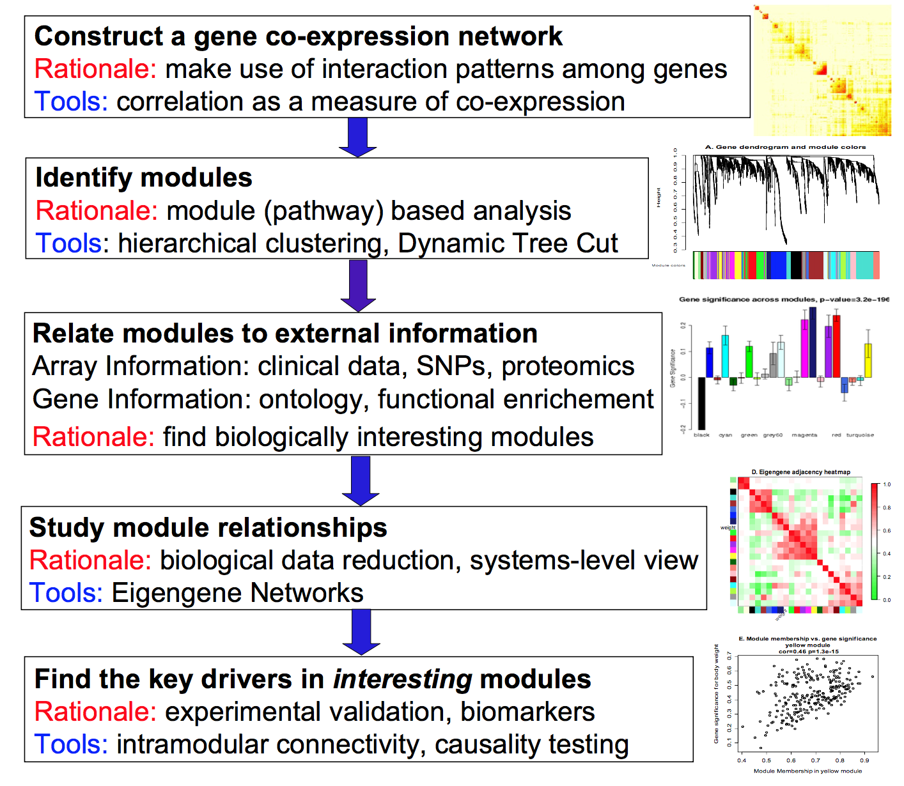

1. 构建基因共表达网络：使用加权的表达相关性。基本目的是充分利用基因间的交互模式；采用相关系数作为共表达的测量。  
2. 识别基因集：基于加权相关性，进行层级聚类分析，并根据设定标准切分聚类结果，获得不同的基因模块，用聚类树的分枝和不同颜色表示。可以采用层次聚类（hierarchical clustering）或动态树切分（dynamic tree cut）实现。  
3. 将模块与外部信息关联。其中外部信息包括基于阵列的临床数据（clinical data），多态性数据（SNPs）和蛋白组数据（proteomics）；基因信息包括ontology和功能富集（functional enrichment）。基本目的是发现具有生物学意义的模块。  
4. 研究模型之间的关系，从系统层面查看不同模型的互作网络。基本目的是生物数据降维，并提供系统水平的视角（system-level view）；采用eigengene网络实现。  
5. 最后发现感兴趣模块的关键驱动子（key drivers）。基本目的是实验验证并明确生物标记（biomarker）；采用的手段可以是模块内连接（intramodular connectivity）以及因果检验（causality testing）。  

## WGCNA包实战  

R包`WGCNA`是用于计算各种加权关联分析的功能集合，可用于网络构建，基因筛选，基因簇鉴定，拓扑特征计算，数据模拟和可视化等。 

### 准备工作  

1. WGCNA本质是基于相关系数的网络分析方法，适用于多样品数据模式，一般要求样本数多于**15**个。样本数多于**20**时效果更好，样本越多，结果越稳定。  
2. 基因表达矩阵: 常规表达矩阵即可，即基因在行，样品在列，进入分析前做一个转置。RPKM、FPKM或其它标准化方法影响不大。  
3. 安装WGCNA   

```R
library(WGCNA)
Loading required package: dynamicTreeCut
Loading required package: fastcluster

Attaching package: ‘fastcluster’

The following object is masked from ‘package:stats’:

    hclust


Attaching package: ‘WGCNA’

The following object is masked from ‘package:stats’:

    cor

options(stringsAsFactors = FALSE)
# 开启多线程
enableWGCNAThreads()
Allowing parallel execution with up to 7 working processes.

load("./data.RData")
head(datTraits)  
                  gsm cellline       subtype
GSM1172844 GSM1172844    184A1 Non-malignant
GSM1172845 GSM1172845    184B5 Non-malignant
GSM1172846 GSM1172846    21MT1         Basal
GSM1172847 GSM1172847    21MT2         Basal
GSM1172848 GSM1172848     21NT         Basal
GSM1172849 GSM1172849     21PT         Basal
fpkm[1:4,1:4]  
                GSM1172844 GSM1172845 GSM1172846  GSM1172847
ENSG00000000003   95.21255   95.69868   19.99467  65.6863763
ENSG00000000005    0.00000    0.00000    0.00000   0.1492021
ENSG00000000419  453.20831  243.64804  142.05818 200.4131493
ENSG00000000457   18.10439   26.56661   16.12776  12.0873135

## 选取前5000高变异的基因计算WGCNA
datExpr <- t(fpkm[order(apply(fpkm,1,mad), decreasing = T)[1:5000],])

```


### 1. 确定最佳beta值  

> 在这里选取的软阈值是为了构建最有效的无尺度网络。

```R
powers = c(c(1:10), seq(from = 12, to=20, by=2))
## 批量计算多个power值的R方	
sft = pickSoftThreshold(datExpr, powerVector = powers, RsquaredCut = 0.85, verbose = 5)

```

```R
pickSoftThreshold: will use block size 5000.
 pickSoftThreshold: calculating connectivity for given powers...
   ..working on genes 1 through 5000 of 5000
   Power SFT.R.sq  slope truncated.R.sq  mean.k. median.k.  max.k.
1      1   0.0944 -0.904          0.885 1040.000  1.02e+03 1810.00
2      2   0.4910 -1.580          0.952  328.000  3.03e+02  866.00
3      3   0.7030 -1.860          0.983  128.000  1.08e+02  474.00
4      4   0.7920 -2.000          0.991   57.300  4.38e+01  283.00
5      5   0.8490 -2.060          0.996   28.400  1.95e+01  179.00
6      6   0.8810 -2.090          0.991   15.200  9.45e+00  118.00
7      7   0.9040 -2.070          0.990    8.640  4.89e+00   80.60
8      8   0.9220 -2.040          0.994    5.170  2.67e+00   56.40
9      9   0.9330 -2.030          0.995    3.240  1.54e+00   40.50
10    10   0.9350 -2.020          0.989    2.100  9.29e-01   30.00
11    12   0.9250 -2.030          0.977    0.971  3.63e-01   17.30
12    14   0.9210 -2.020          0.982    0.496  1.56e-01   10.50
13    16   0.9250 -1.970          0.992    0.275  7.04e-02    6.61
14    18   0.8940 -1.960          0.973    0.163  3.31e-02    4.31
15    20   0.9220 -1.820          0.986    0.102  1.63e-02    2.89
power = sft$powerEstimate
power
[1] 6
```

> 由以上结果可以看出在power = 6时首次达到R方的cut阈值0.85，因此选取6作为合适的power值

通过绘图更加直观的观察阈值的选取：

```R
 par(mfrow = c(1,2));
 cex1 = 0.9;
 # Scale-free topology fit index as a function of the soft-thresholding power
 plot(sft$fitIndices[,1], -sign(sft$fitIndices[,3])*sft$fitIndices[,2],
       xlab="Soft Threshold (power)",ylab="Scale Free Topology Model Fit,signed R^2",type="n",
       main = paste("Scale independence"));
 text(sft$fitIndices[,1], -sign(sft$fitIndices[,3])*sft$fitIndices[,2],
       labels=powers,cex=cex1,col="red");
 # this line corresponds to using an R^2 cut-off of h
 abline(h=0.85,col="red")
 # Mean connectivity as a function of the soft-thresholding power
 plot(sft$fitIndices[,1], sft$fitIndices[,5],
       xlab="Soft Threshold (power)",ylab="Mean Connectivity", type="n",
       main = paste("Mean connectivity"))
 text(sft$fitIndices[,1], sft$fitIndices[,5], labels=powers, cex=cex1,col="red")
```

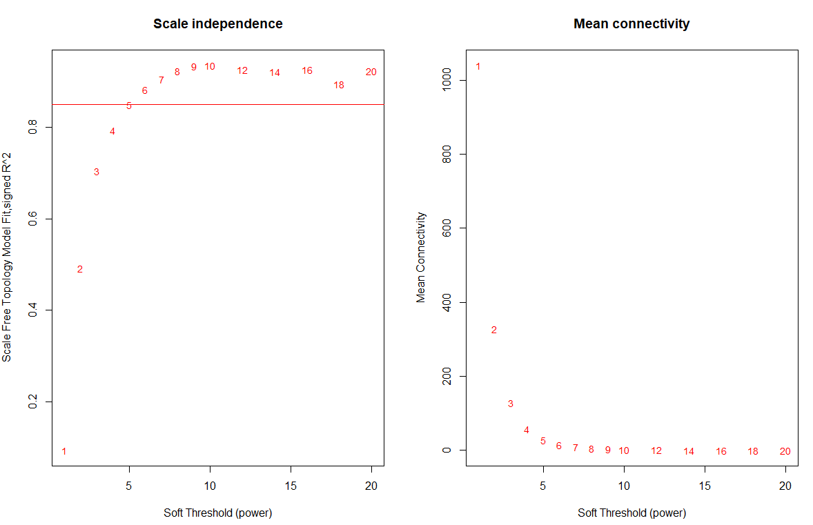

> 假如没有合适的阈值，在官方文档中说，如果是unsigned的就选6，如果是signed的就选12.  

### 2. 网络构建   

#### 一步法构建  

`WGCNA`提供了`blockwiseModules`函数可以一步计算出所有的模块

```R
##一步法网络构建：One-step network construction and module detection
# numericLabels: 返回数字而不是颜色作为模块的名字，后面可以再转换为颜色
# saveTOMs：最耗费时间的计算，存储起来，供后续使用
# mergeCutHeight: 合并模块的阈值，越大模块越
net = blockwiseModules(datExpr, power = power, maxBlockSize = 6000,
                       TOMType = type, minModuleSize = 30,
                       reassignThreshold = 0, mergeCutHeight = 0.25,
                       numericLabels = TRUE, pamRespectsDendro = FALSE,
                       saveTOMs=TRUE, corType = corType, 
                       maxPOutliers=maxPOutliers, loadTOMs=TRUE,
                       saveTOMFileBase = paste0(exprMat, ".tom"), ## 保存tom矩阵
                       verbose = 3)
```

展示最终层级聚类的结果  

```R
## 灰色的为未分到模块的基因。
# Convert labels to colors for plotting
moduleLabels = net$colors
moduleColors = labels2colors(moduleLabels)
# Plot the dendrogram and the module colors underneath
plotDendroAndColors(net$dendrograms[[1]], moduleColors[net$blockGenes[[1]]],
                    "Module colors",
                    dendroLabels = FALSE, hang = 0.03,
                    addGuide = TRUE, guideHang = 0.05)
```

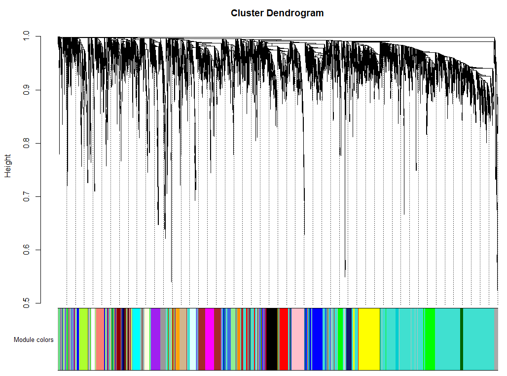

#### 分步构建  

首先计算邻接矩阵  

```R
# calculate the adjacency
softPower = 6;
adjacency = adjacency(datExpr, power = softPower);
```

将邻接矩阵转换成拓扑重叠矩阵  

```R
# Turn adjacency into topological overlap
TOM = TOMsimilarity(adjacency);
dissTOM = 1-TOM
```

对TOM进行聚类  

```R
# Call the hierarchical clustering function
geneTree = hclust(as.dist(dissTOM), method = "average");
# Plot the resulting clustering tree (dendrogram)
plot(geneTree, xlab="", sub="", main = "Gene clustering on TOM-based dissimilarity",
     labels = FALSE, hang = 0.04);
```

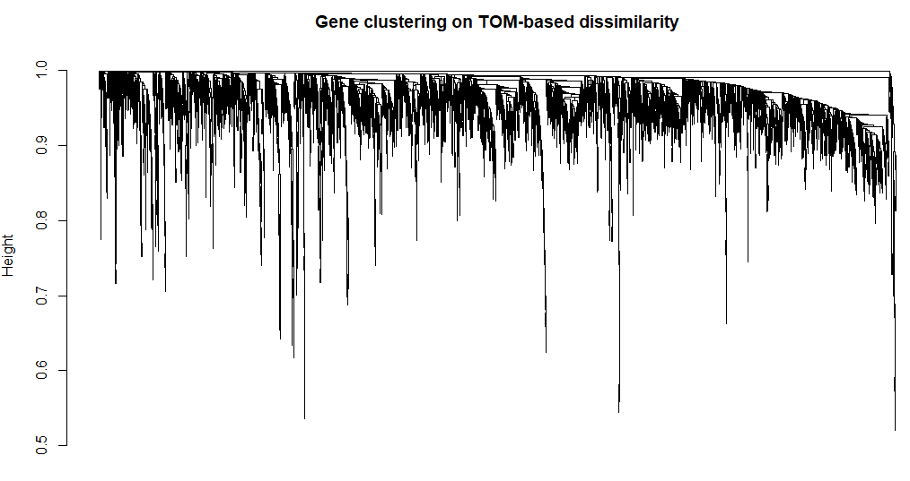

上面得到了基因聚类的树，我们对这棵树进行剪枝得到不同的模块  

```R
# We like large modules, so we set the minimum module size relatively high:
minModuleSize = 30;
# Module identification using dynamic tree cut:
dynamicMods = cutreeDynamic(dendro = geneTree, distM = dissTOM,
                            deepSplit = 2, pamRespectsDendro = FALSE,
                            minClusterSize = minModuleSize);
table(dynamicMods)
```

得到模块后我们就可以看到不同的模块表示 

```R
# Convert numeric lables into colors
dynamicColors = labels2colors(dynamicMods)
table(dynamicColors)
# Plot the dendrogram and colors underneath
plotDendroAndColors(geneTree, dynamicColors, "Dynamic Tree Cut",
                    dendroLabels = FALSE, hang = 0.03,
                    addGuide = TRUE, guideHang = 0.05,
                    main = "Gene dendrogram and module colors")
```

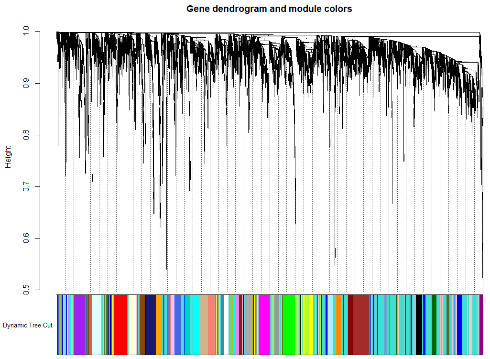  

这样我们就得到了不同的基因表达模块。然而在这时某些模块之间也有可能具有很高的相似性，为了进一步衡量这些模块之间的共表达相似性，我们计算了eigengenes然后计算他们之间的相似性。  

```R
MEList = moduleEigengenes(datExpr, colors = dynamicColors)
MEs = MEList$eigengenes
# Calculate dissimilarity of module eigengenes
MEDiss = 1-cor(MEs);
# Cluster module eigengenes
METree = hclust(as.dist(MEDiss), method = "average");
# Plot the result
plot(METree, main = "Clustering of module eigengenes",
xlab = "", sub = "")
# 在这里选取0.25作为阈值对eigengenes进行合并  
MEDissThres = 0.25
# Plot the cut line into the dendrogram
abline(h=MEDissThres, col = "red")
```

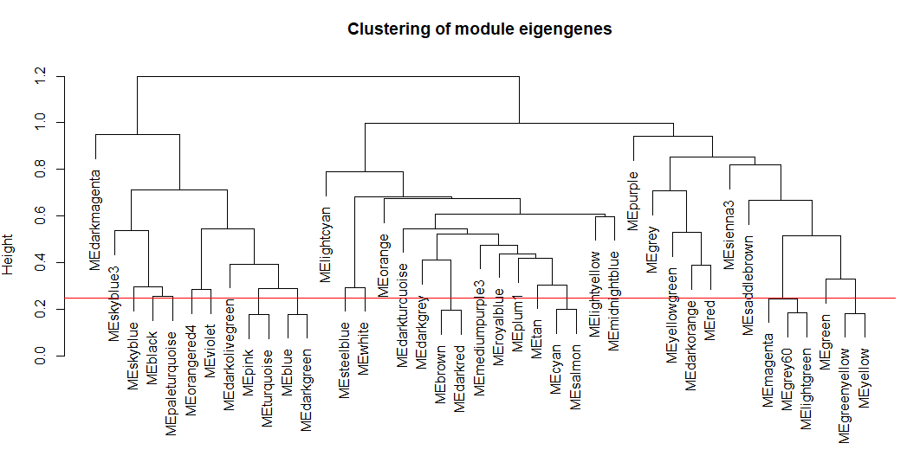  


```R
# Call an automatic merging function
merge = mergeCloseModules(datExpr, dynamicColors, cutHeight = MEDissThres, verbose = 3)
# The merged module colors
mergedColors = merge$colors;
# Eigengenes of the new merged modules:
mergedMEs = merge$newMEs;
plotDendroAndColors(geneTree, cbind(dynamicColors, mergedColors),
                    c("Dynamic Tree Cut", "Merged dynamic"),
                    dendroLabels = FALSE, hang = 0.03,
                    addGuide = TRUE, guideHang = 0.05)
```

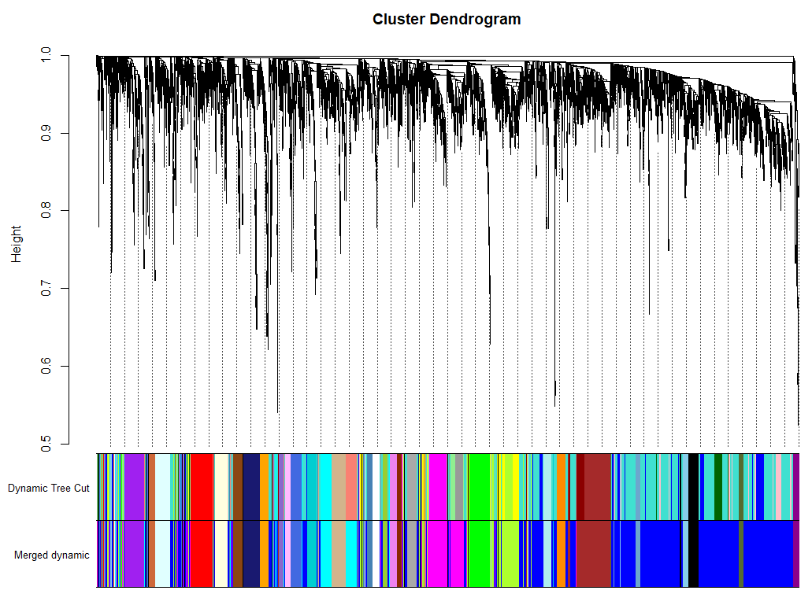  

> 这个结果其实和一步计算的结果基本一致,得到模块数目相同  

### 3. 模块之间的相关性  

```R
# module eigengene, 可以绘制线图，作为每个模块的基因表达趋势的展示
MEs = net$MEs
MEs_col = MEs
colnames(MEs_col) = paste0("ME", labels2colors(
  as.numeric(str_replace_all(colnames(MEs),"ME",""))))
MEs_col = orderMEs(MEs_col)
# marDendro/marHeatmap 设置下、左、上、右的边距
plotEigengeneNetworks(MEs_col, "Eigengene adjacency heatmap", 
                      marDendro = c(3,3,2,4),
                      marHeatmap = c(3,4,2,2), plotDendrograms = T, 
                      xLabelsAngle = 90)
```

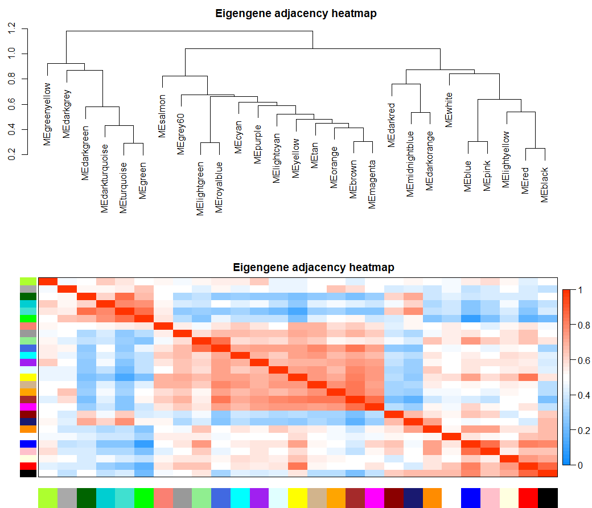  

### 4. 样本和性状的聚类关系  

```R
nGenes = ncol(datExpr)
nSamples = nrow(datExpr)
#首先针对样本做个系统聚类
datExpr_tree<-hclust(dist(datExpr), method = "average")
sample_colors <- numbers2colors(as.numeric(factor(datTraits$subtype)), 
                                colors = c("white","blue","red","green"),signed = FALSE)
par(mar = c(1,4,3,1),cex=0.8)
plotDendroAndColors(datExpr_tree, sample_colors,
                      groupLabels = colnames(sample),
                      cex.dendroLabels = 0.8,
                      marAll = c(1, 4, 3, 1),
                      cex.rowText = 0.01,
                      main = "Sample dendrogram and trait heatmap")
```

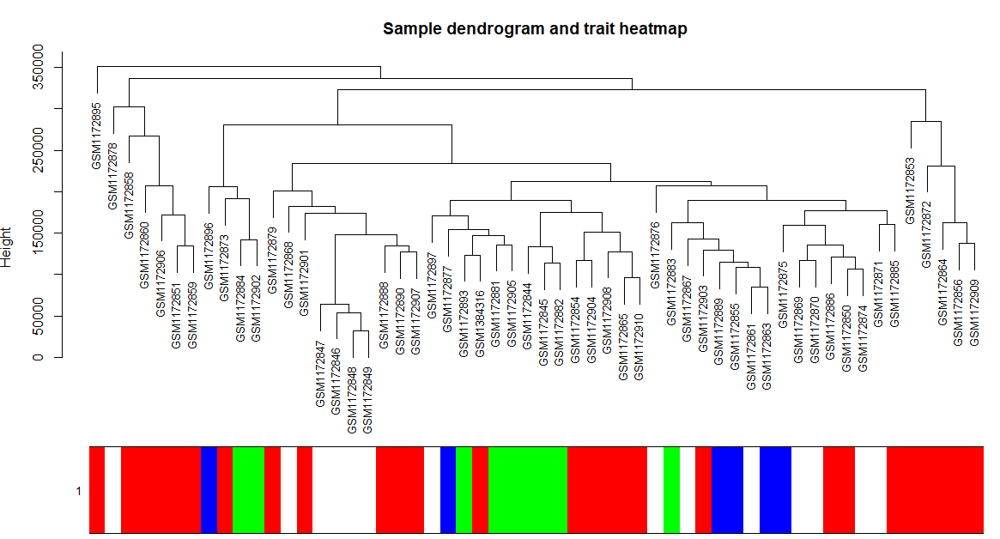  

条形图展示  

```R
Luminal = as.data.frame(design[,3]);
names(Luminal) = "Luminal"
y=Luminal
GS1=as.numeric(cor(y,datExpr, use="p"))
GeneSignificance=abs(GS1)
# Next module significance is defined as average gene significance.
ModuleSignificance=tapply(GeneSignificance,
                          moduleColors, mean, na.rm=T)
sizeGrWindow(8,7)
par(mfrow = c(1,1))
# 如果模块太多，下面的展示就不友好
# 不过，我们可以自定义出图。
plotModuleSignificance(GeneSignificance,moduleColors)
```

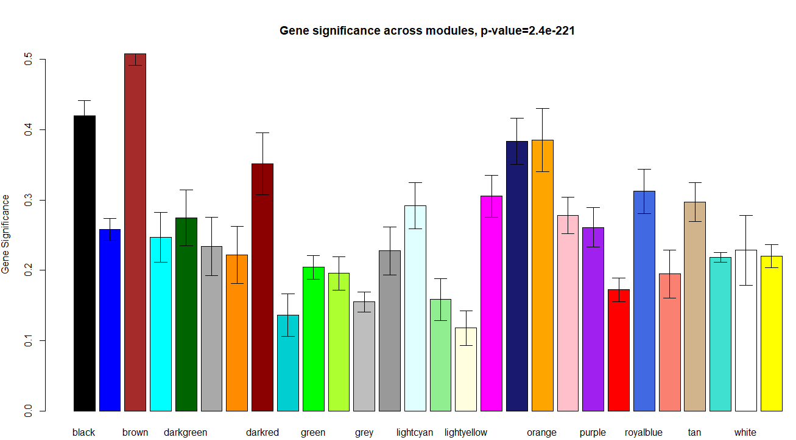  


### 5. 可视化基因网络  

```R
nSelect = 400
# For reproducibility, we set the random seed
set.seed(10);
select = sample(nGenes, size = nSelect);
selectTOM = dissTOM[select, select];
# There’s no simple way of restricting a clustering tree to a subset of genes, so we must re-cluster.
selectTree = hclust(as.dist(selectTOM), method = "average")
selectColors = moduleColors[select];
plotDiss = selectTOM^7;
diag(plotDiss) = NA;
TOMplot(plotDiss, selectTree, selectColors, main = "Network heatmap plot, selected genes")
```

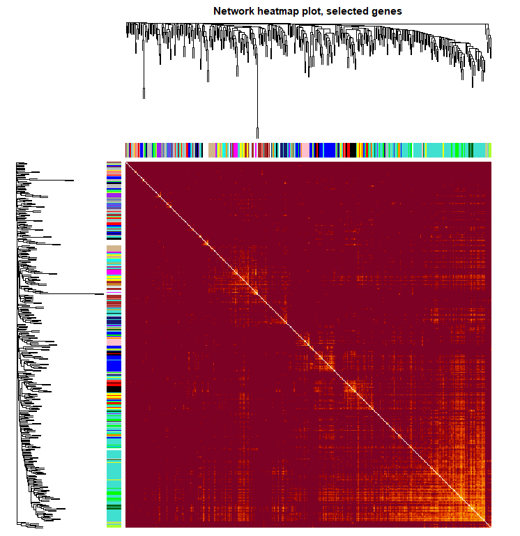  


### 6. 模块和性状的关系  

```R
nGenes = ncol(datExpr)
nSamples = nrow(datExpr)
design=model.matrix(~0+ datTraits$subtype)
colnames(design)=levels(datTraits$subtype)
moduleColors <- labels2colors(net$colors)
# Recalculate MEs with color labels
MEs0 = moduleEigengenes(datExpr, moduleColors)$eigengenes
MEs = orderMEs(MEs0); ##不同颜色的模块的ME值矩 (样本vs模块)
moduleTraitCor = cor(MEs, design , use = "p");
moduleTraitPvalue = corPvalueStudent(moduleTraitCor, nSamples)

sizeGrWindow(10,6)
# Will display correlations and their p-values
textMatrix = paste(signif(moduleTraitCor, 2), "\n(",
                   signif(moduleTraitPvalue, 1), ")", sep = "");
dim(textMatrix) = dim(moduleTraitCor)
par(mar = c(6, 8.5, 3, 3));
# Display the correlation values within a heatmap plot
labeledHeatmap(Matrix = moduleTraitCor,
               xLabels = colnames(design),
               yLabels = names(MEs),
               ySymbols = names(MEs),
               colorLabels = FALSE,
               colors = greenWhiteRed(50),
               textMatrix = textMatrix,
               setStdMargins = FALSE,
               cex.text = 0.5,
               zlim = c(-1,1),
               main = paste("Module-trait relationships"))
```

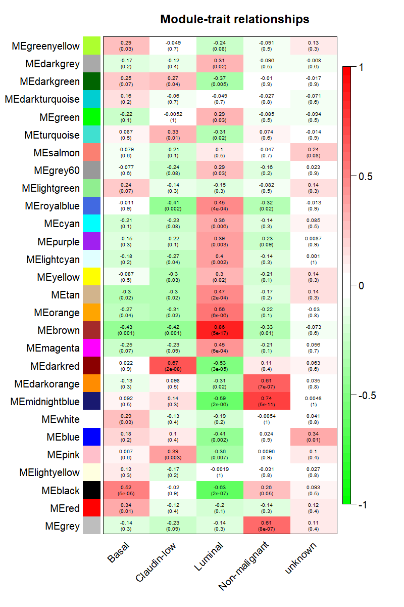  

从上图已经可以看到跟乳腺癌分类相关的基因模块了，包括`Basal` 、`Claudin-low` 、`Luminal` 、`Non-malignant`、`unknown` 这5类所对应的不同模块的基因列表。可以看到每一种乳腺癌都有跟它强烈相关的模块，可以作为它的表达signature，模块里面的基因可以拿去做下游分析。我们看到**Luminal表型**跟**棕色的模块**相关性高达0.86，而且极其显著的相关，所以值得我们挖掘，这**个模块里面的基因是什么，为什么如此的相关呢？**  

### 7. 感兴趣模块的具体分析   

性状跟模块虽然求出了相关性，可以挑选最相关的那些模块来分析，但是模块本身仍然包含非常多的基因，还需进一步的寻找最重要的基因。所有的模块都可以跟基因算出相关系数，所有的连续型性状也可以跟基因的表达值算出相关系数。 **如果跟性状显著相关基因也跟某个模块显著相关，那么这些基因可能就非常重要**。  

#### 计算模块与基因的相关性矩阵  

```R
# names (colors) of the modules
modNames = substring(names(MEs), 3)
## 算出每个模块跟基因的皮尔森相关系数矩阵
geneModuleMembership = as.data.frame(cor(datExpr, MEs, use = "p"));
MMPvalue = as.data.frame(corPvalueStudent(as.matrix(geneModuleMembership), nSamples));
names(geneModuleMembership) = paste("MM", modNames, sep="");
names(MMPvalue) = paste("p.MM", modNames, sep="");

```

#### 计算性状与基因的相关性矩阵  

```R
## 只有连续型性状才能只有计算
## 这里把是否属于 Luminal 表型这个变量用0,1进行数值化。
Luminal = as.data.frame(design[,3]);
names(Luminal) = "Luminal"
geneTraitSignificance = as.data.frame(cor(datExpr, Luminal, use = "p"));
GSPvalue = as.data.frame(corPvalueStudent(as.matrix(geneTraitSignificance), nSamples));
names(geneTraitSignificance) = paste("GS.", names(Luminal), sep="");
names(GSPvalue) = paste("p.GS.", names(Luminal), sep="");
```

####  指定感兴趣模块进行分析  

```R
module = "brown"
column = match(module, modNames);
moduleGenes = moduleColors==module;
sizeGrWindow(7, 7)
par(mfrow = c(1,1))
verboseScatterplot(abs(geneModuleMembership[moduleGenes, column]),
                     abs(geneTraitSignificance[moduleGenes, 1]),
                     xlab = paste("Module Membership in", module, "module"),
                     ylab = "Gene significance for Luminal",
                     main = paste("Module membership vs. gene significance\n"),
                     cex.main = 1.2, cex.lab = 1.2, cex.axis = 1.2, col = module)
```

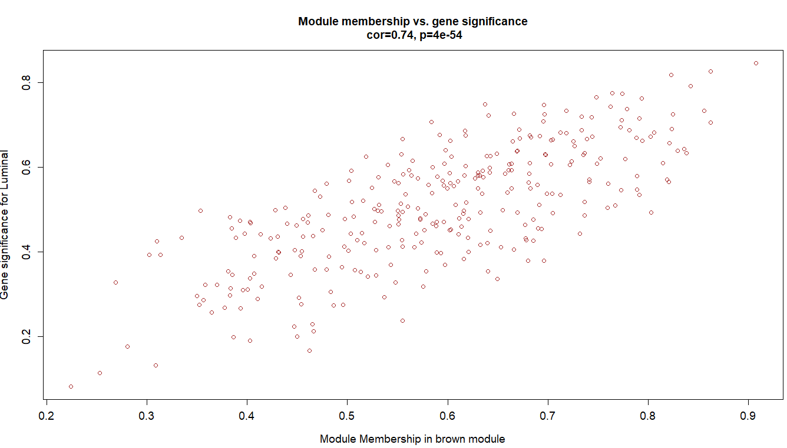  

可以看到这些基因不仅仅是跟其对应的模块高度相关，而且是跟其对应的性状高度相关，进一步说明了基因值得深度探究。  

### 8. 提取指定模块的基因名  

```R
# Select module
module = "brown";
# Select module probes
probes = colnames(datExpr) ## 我们例子里面的probe就是基因
inModule = (moduleColors==module);
modProbes = probes[inModule]; 
head(modProbes)

# 如果使用WGCNA包自带的热图就很丑。
which.module="brown";
dat=datExpr[,moduleColors==which.module ] 
plotMat(t(scale(dat)),nrgcols=30,rlabels=T,
        clabels=T,rcols=which.module,
        title=which.module )
datExpr[1:4,1:4]
dat=t(datExpr[,moduleColors==which.module ] )
library(pheatmap)
pheatmap(dat ,show_colnames =F,show_rownames = F) #对那些提取出来的1000个基因所在的每一行取出，组合起来为一个新的表达矩阵
n=t(scale(t(log(dat+1)))) # 'scale'可以对log-ratio数值进行归一化
n[n>2]=2 
n[n< -2]= -2
n[1:4,1:4]
pheatmap(n,show_colnames =F,show_rownames = F)
group_list=datTraits$subtype
ac=data.frame(g=group_list)
rownames(ac)=colnames(n) 
pheatmap(n,show_colnames =F,show_rownames = F,
         annotation_col=ac )
# 可以很清晰的看到，所有的形状相关的模块基因
# 其实未必就不是差异表达基因。
```

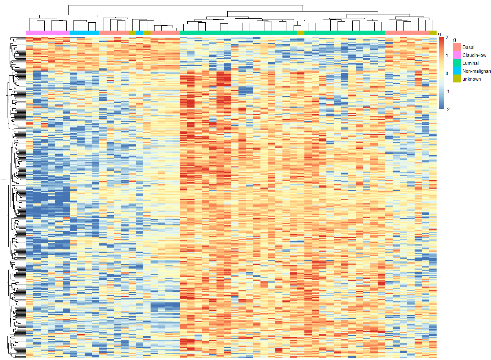  

有了基因信息，后边就可以进行GO/KEGG等功能数据库的注释  

### 9. 模块导出  

主要模块里面的基因直接的相互作用关系信息可以导出到**cytoscape**,**VisANT**等网络可视化软件。  

```R
# Select module
module = "brown";
# Select module probes
probes = colnames(datExpr) ## 我们例子里面的probe就是基因名
inModule = (moduleColors==module);
modProbes = probes[inModule]; 
## 也是提取指定模块的基因名
# Select the corresponding Topological Overlap
modTOM = TOM[inModule, inModule];
dimnames(modTOM) = list(modProbes, modProbes)
```

导出到**cytoscape**  

```R
 cyt = exportNetworkToCytoscape(
       modTOM,
      edgeFile = paste("CytoscapeInput-edges-", paste(module, collapse="-"), ".txt", sep=""),
      nodeFile = paste("CytoscapeInput-nodes-", paste(module, collapse="-"), ".txt", sep=""),
      weighted = TRUE,
      threshold = 0.02,
      nodeNames = modProbes, 
      nodeAttr = moduleColors[inModule]);
```


### Reference  

1. [WGCNA分析，简单全面的最新教程](https://www.jianshu.com/p/e9cc3f43441d)  
2. https://horvath.genetics.ucla.edu/html/CoexpressionNetwork/  

